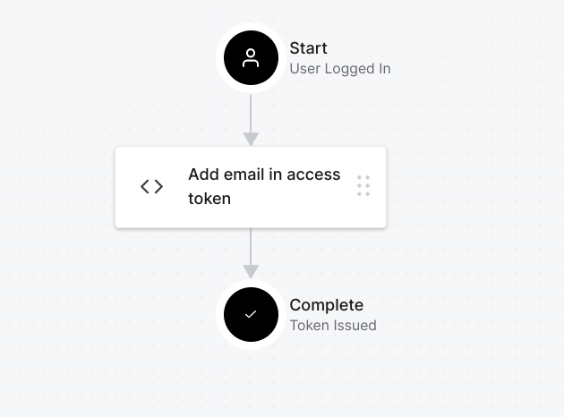

# Auth0 integration

This is a sample project to test Auth0 integration with NestJS for creation of a plugin.

## Installation

```sh
$ npm install
```

## Running the app

Follow the instructions in the individual README.md files in the [Admin-UI](./admin-ui/README.md) and [Server](./server/README.md) folders.

## Prerequisites

- [Auth0](https://auth0.com/) account
- [Create an Auth0 application](#create-an-auth0-application) ( Single Page Application )
- [Create an Auth0 API](#create-an-auth0-api) ( Machine to Machine )
- [Create an Auth0 action](#create-an-auth0-action) ( Post Login ) to add the user's name, email in access token
- Create an admin user in the postgres database made through the [docker-compose](./server/docker-compose.dev.yml) file with sample data as shown in the swagger documentation of the [server](./server/README.md) project. Add same email and name as the one to be used during login in Auth0. [Sample](#create-an-admin-user-in-the-postgres-database)

## Elaboration

### Create an Auth0 application

- Go to [Auth0](https://auth0.com/) and create an account.
- Create a new application of type Single Page Application ( Select the React Quickstart )
- Change the following values to their keys :-

  - Allowed Callback URLs : http://localhost:3001/auth-callback
  - Allowed Logout URLs : http://localhost:3001/login
  - Allowed Web Origins : http://localhost:3001

- Update the [ Environment Variables ](./admin-ui/.env) in the admin-ui project with the values of the Auth0 application created :-
  ```js
  REACT_APP_AUTH0_DOMAIN = YOUR_AUTH0_DOMAIN;
  REACT_APP_AUTH0_CLIENT_ID = YOUR_AUTH0_CLIENT_ID;
  ```

### Create an Auth0 API

- Go to the dashboard and create a new API of type Machine to Machine
- Set the following values :-

  - Identifier : https://sample-nest.demo.com
  - Signing Algorithm : RS256

- Update the [ Environment Variables ](./server/.env) in the server project with the values of the Auth0 API created :-
  ```js
  AUTH0_AUDIENCE = YOUR_AUTH0_API_IDENTIFIER; // https://sample-nest.demo.com
  AUTH0_ISSUER = YOUR_AUTH0_DOMAIN; // Look at quickstart for the format
  ```

### Create an Auth0 action

- Go to the dashboard and create a new action of type Post Login through Flows tab ----> Login -----> Create Action
- Set the following values :-

  - Name : Add user details to access token
  - Code :-

    ```js
    exports.onExecutePostLogin = async (event, api) => {
      console.log(event.user);
      if (event.authorization) {
        // Set claims
        api.accessToken.setCustomClaim(`name`, event.user.name);
        api.accessToken.setCustomClaim(`email`, event.user.email);
      }
    };
    ```

- Save and deploy the action
- Put the action in the Login flow by going to Flows tab ----> Login -----> Select the action from the dropdown and put it between Login and Token issued.
  

### Create an admin user in the postgres database

- Go to the terminal of your docker container and run the following commanf to get into the postgres database :-

  ```sh
  $ psql -U admin -d admin
  ```

- Change database to the one created for the project :-

  ```sh
  $ \c my-db
  ```

- Create a new user with the following command :-

  ```sh
  # Replace the values with your own
  $ INSERT INTO user ("id", "name", "bio", "email", "age", "birthDate", "score", "managerId", "interests", "priority", "isCurious", "location", "extendedProperties", "profileId", "username", "password", "roles")
  VALUES ('your_user_id', 'Ashish Padhy', 'This is a bio', 'ashishpadhy1729@gmail.com', 30, '1993-09-14T00:00:00Z', 4.5, NULL, ARRAY['programming']::"EnumUserInterests"[], 'EnumUserPriorityValue', TRUE, 'LocationValue', '{}', NULL, 'ashishpadhy', 'hashed_password', '["admin"]');
  ```

- The user can now login with the email in Auth0.
